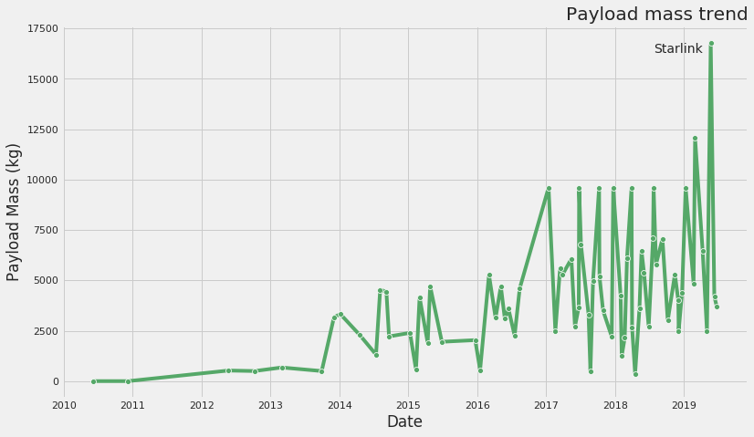
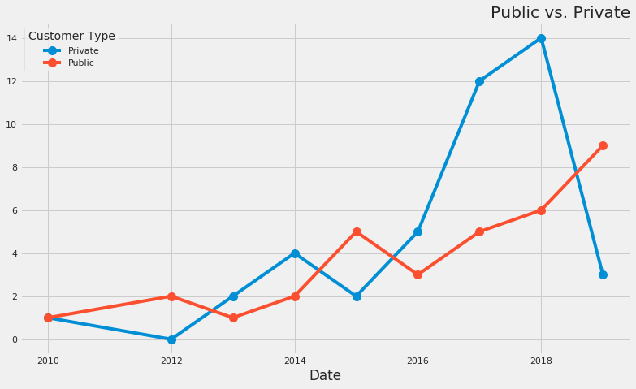

Outline:

Intro with some SpaceX history
Increasing amount of business/payloads (include payload mass viz)

Public vs Private customers (include 'who are customers" and pubpriv barchart viz)

Profitability
  a. different charges based on customer type (include viz)
  b. costs. Is spacex profitable?
 

