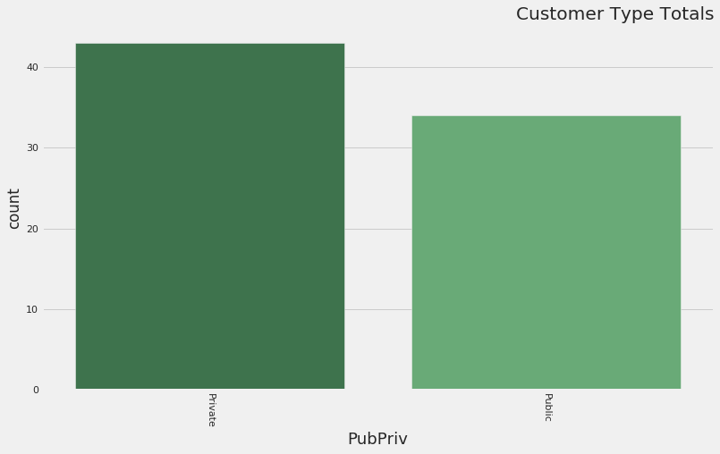
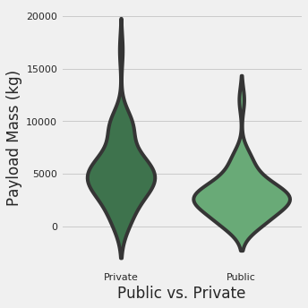
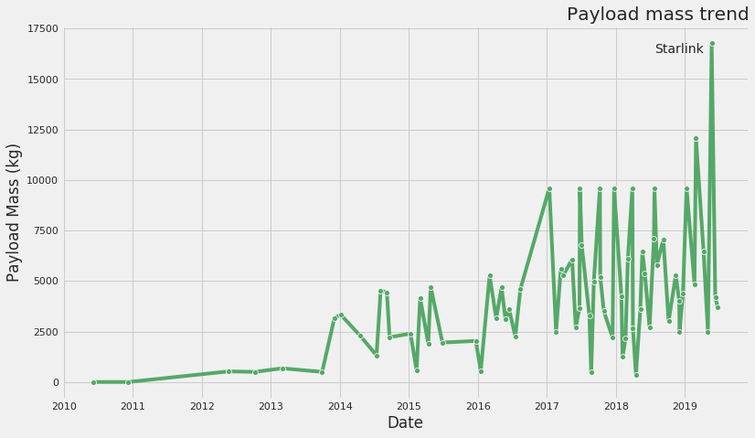
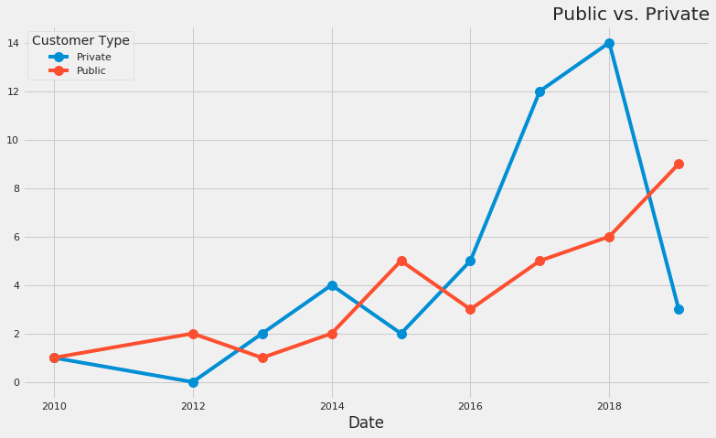
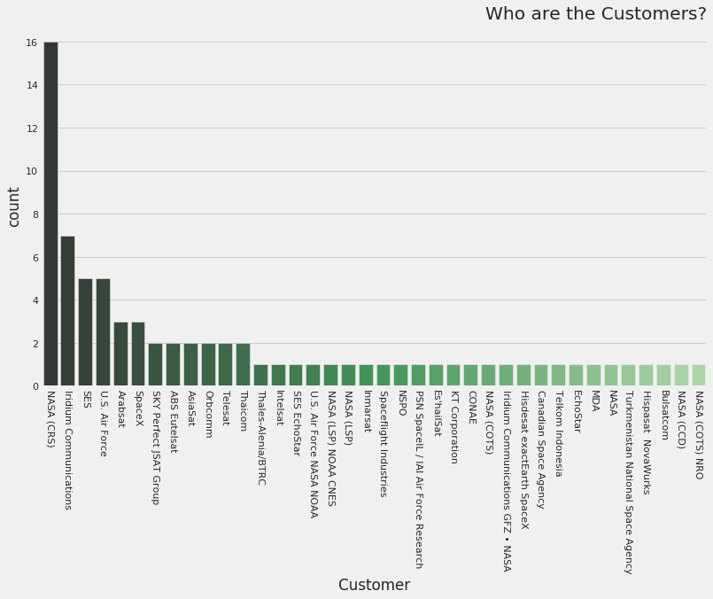
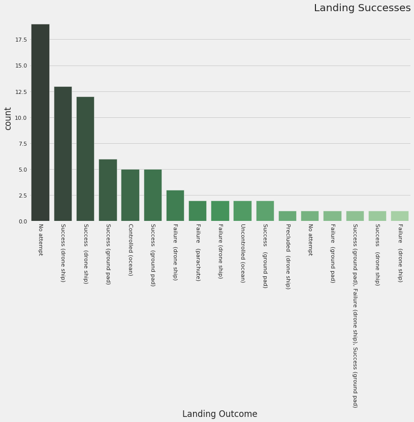

SpaceX was founded in 2002 with the express purpose of driving down the cost of commercial spaceflight. One of the principal means of achieving this began in officially in 2013 with the announcement of the rapid reuse launch system. Unofficially, reuse began with the failed Falcon 1 in 2008. Regardless, this post will take a look at SpaceX's progess since it's introduction of the Falcon 9 launch vehicle family in 2010.

My initial hypothesis was that SpaceX's customer base would be majority public entities such as NASA or the military. The primary reasons was a larger potential customer base and therefore a greater opportunity to win contracts from governmental customers. I was wrong. While the very earliest customers where indeed governmental (Falcon 1's final flight was delivery of a Malaysian satellite), very quickly private customers booked payloads with Spacex. In fact, the majority of customers have been private. 

Private customers are also skew heavier in terms of payload mass.

And payload mass is where the money is. Like many retail outlets, SpaceX's aim is to provide discounts for larger loads. Doing so has made SpaceX one of the cheapest carriers on a per kg basis. They've won more business and are spurring competitors. Below we see how the payload mass has been trending upward as successive Falcon generations have been developed.

And the number of missions are also trending upward. There are 10 more missions scheduled in the remainder of 2019.

According to [recent data](https://www.reddit.com/r/spacex/comments/7lp52o/a_thorough_examination_of_the_economics_of_falcon/), SpaceX charges $62 million to most customers and $133 to NASA for Falcon and Dragon missions. Since 2018 there have been 7 NASA missions and 23 other missions for an estimated **gross revenue of $2.4 billion**. Using [2016 data](https://docs.google.com/spreadsheets/d/1vR0YKQHsOQoCD6iWYGrrQT_Wth75UEqeENHPPosaWck/edit?usp=sharing) (though SpaceX is known for its aggressive cost cutting measures), SpaceX has an average per mission cost of $87 million. This means for the 30 missions since 2018, SpaceX's **costs were $2.6 billion**. SpaceX is probably not yet profitable but it is getting close.

Outline:

Intro with some SpaceX history
Increasing amount of business/payloads (include payload mass viz)

Public vs Private customers (include 'who are customers" and pubpriv barchart viz)

Profitability
  a. different charges based on customer type (include viz)
  b. costs. Is spacex profitable?
 

SpaceX has suffered some spectacular failures. The most recent was a high stakes, high speed landing on the autonomous drone ship _Of Course I Still Love You_. One of my initial interests in studying SpaceX's launch history was to see if there was any pattern to the failures. Fortunately I found none. The only connection I did find was in the orbit types. Using a $${\chi}^2$$-test I found a significant relationship ($$ p < .01 $$) between orbit types and whether the customer was a public or private entity. Public customers, of which the majority is NASA, tend to prefer higher altitude orbits or low Earth orbit missions to the space station.

|Orbit	|GTO	|HEO|	Heliocentric 0.99–1.67 AU |	LEO|	LEO (ISS)|	LEO / MEO|	MEO|	Polar LEO|	SSO|	Sun–Earth L1|	All|
|:------ |:--- | :--- | :--- | :--- | :--- | :--- | :--- | :--- | :--- | :--- | :--- |
|PubPriv											
|Private	|26|	0|	1|	5|	0|	0|	0|	8|	3|	0|	43|
|Public|	4|	1|	0|	2|	20|	3|	1|	0|	2|	1|	34|
|All|	30|	1|	1|	7|	20|	3|	1|	8|	5|	1|	77|

[View the ipython notebook](https://github.com/1aaronscott/1aaronscott.github.io/blob/master/SpaceX_Project.ipynb)
