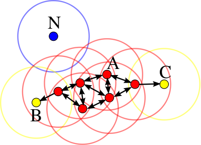

{: .center-block :}
[KDnuggets](https://www.kdnuggets.com/2020/04/dbscan-clustering-algorithm-machine-learning.html)

## Why?
Recently I was tasked with implementing one of several algorithms
common in data science. I was least familiar with DBSCAN so that's the
one I chose.  DBSCAN stands for Density-based spatial clustering of
applications with noise[0]. It is best suited for clustering high
density spatial data isolated by low density areas. When this is
satisfied, DBSCAN works well for any type of spatial data regardless
of shape [1].

## How?
At the top of this post you can see an animation showing how DBSCAN in action.
Here is a basic rundown of how DBSCAN works.  Two metrics are chosen
initially: a distance measurement (&epsilon;) and a cluster size (M).
A point is chosen and if that point has M points (including itself) at
most &epsilon; distance away. Those points then form a cluster. If a
point a point is with &epsilon; distance from a cluster but doesn't
have at least M points in reach, it is considered boundary or edge
point of that cluster. A point which is not close enough to reach a
cluster is a noise point.  In this Wikipedia image, the red dots are
"core" to the cluster and the yellow are boundary points. They are all
part of the cluster. The blue dot is too far away and is considered
noise.

{: .center-block :}

## What?
The Wikipedia page provides some pseudocode which I used as guidance
for building my implementation. It's a translation of similar code
provide by Schubert et. al.[2]. It appeared simple enough but of
course translating to functional code can always present some
challenges. After several days of coding and reviewing other
implementations such scikit learn's [3] and others (some functional[4]
and some not[5]), I made a functional class available on my GitHub[6].
Here we see an initial sample dataset. The clusters are easily
recognizable by the human eye.

{: .center-block :}

Here we complicate things by introducing some noise

{: .center-block :}

and combining the two.

{: .center-block :}

Here are the clusters created by my DBSCAN implementation:

{: .center-block :}

And here is the result from the same dataset using scikit learn's
DBSCAN:

{: .center-block :}

Visually, they're pretty close! Still there are a few avenues for improvement:

* My code was about 73 times slower than the scikit learn code. Plenty of room for refactoring
but not bad given the time and resource constraints.
* Incorporate the code into a Game of Life game to better demonstrate it's potential
in a more engaging way for users.

References:
[0] [https://en.wikipedia.org/wiki/DBSCAN](https://en.wikipedia.org/wiki/DBSCAN)
[1] [https://scikit-learn.org/stable/modules/clustering.html#DBSCAN](https://scikit-learn.org/stable/modules/clustering.html#DBSCAN)
[2] [https://dl.acm.org/doi/pdf/10.1145/3068335](https://dl.acm.org/doi/pdf/10.1145/3068335)
[3] [https://github.com/scikit-learn/scikit-learn/blob/master/sklearn/cluster/_dbscan.py](https://github.com/scikit-learn/scikit-learn/blob/master/sklearn/cluster/_dbscan.py)
[4] [https://github.com/chrisjmccormick/dbscan/blob/master/dbscan.py](https://github.com/chrisjmccormick/dbscan/blob/master/dbscan.py)
[5] [http://www.programmersought.com/article/2297928249/](http://www.programmersought.com/article/2297928249/)
[6] [https://github.com/1aaronscott/CS29-Unit1-Build-Week](https://github.com/1aaronscott/CS29-Unit1-Build-Week)